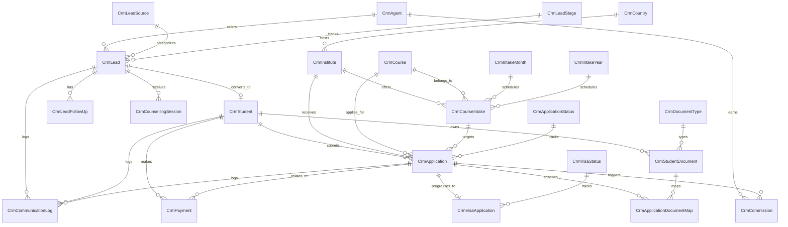

# Education CRM v1 Implementation Package

> **Purpose:** Lock the v1 education CRM scope before coding starts.
> **Architecture Alignment:** Clean Architecture + DB-first + existing `Crm*` naming + `ApiResponse<T>` response wrapper.
> **Base API Route:** `/bdDevs-crm`
> **Status:** Approved planning package for backend and MVC implementation kickoff.

---

## 1. Final Scope Lock (v1 Modules)

### Core v1 Modules
1. **Lead Management**
2. **Follow-up Management**
3. **Counselling Management**
4. **Student Management**
5. **Document Management**
6. **Application Management**
7. **Visa Management**
8. **Agent Management**
9. **Finance Management**
10. **Communication Management**

### Out of Scope for v1
- Marketing automation
- Bulk campaign engine
- Advanced workflow designer
- BI/warehouse analytics
- Third-party university API sync
- Full accounting ledger integration

---

## 2. Module Breakdown: Master Data vs Transactional Data

### Master Data
| Module Area | Entity / Table | Purpose |
|---|---|---|
| Geography | `CrmCountry` | Destination country master |
| Institution | `CrmInstitute` | University / college master |
| Course | `CrmCourse` | Course / program master |
| Intake | `CrmIntakeMonth`, `CrmIntakeYear`, `CrmCourseIntake` | Intake planning |
| Document | `CrmDocumentType` | Required document type catalog |
| Lead | `CrmLeadSource`, `CrmLeadStage` | Lead origin and pipeline stage |
| Counselling | `CrmCounsellingType` | Session type setup |
| Application | `CrmApplicationStatus` | Application workflow states |
| Visa | `CrmVisaStatus` | Visa workflow states |
| Finance | `CrmPaymentMethod`, `CrmCommissionType` | Payment and commission setup |
| Communication | `CrmCommunicationType`, `CrmCommunicationTemplate` | Channel/template master |
| Partner | `CrmAgent` | Agency / partner master |

### Transactional Data
| Module Area | Entity / Table | Purpose |
|---|---|---|
| Lead | `CrmLead` | Primary enquiry record |
| Follow-up | `CrmLeadFollowUp` | Lead follow-up schedule/history |
| Counselling | `CrmCounsellingSession` | Counselling interactions |
| Student | `CrmStudent` | Converted lead / enrolled student profile |
| Document | `CrmStudentDocument` | Uploaded and verified documents |
| Application | `CrmApplication` | University application case |
| Application | `CrmApplicationDocumentMap` | Document-to-application linkage |
| Visa | `CrmVisaApplication` | Visa processing case |
| Finance | `CrmPayment` | Student/agent-related financial transaction |
| Finance | `CrmCommission` | Agent commission record |
| Communication | `CrmCommunicationLog` | Calls, email, SMS, WhatsApp history |

---

## 3. Core Relationship Lock (ERD)



### Locked FK Rules
- `CrmLead.AgentId` → `CrmAgent.AgentId` (nullable)
- `CrmLeadFollowUp.LeadId` → `CrmLead.LeadId`
- `CrmCounsellingSession.LeadId` → `CrmLead.LeadId`
- `CrmStudent.LeadId` → `CrmLead.LeadId` with unique constraint to enforce one lead-to-student conversion record
- `CrmStudentDocument.StudentId` → `CrmStudent.StudentId`
- `CrmApplication.StudentId` → `CrmStudent.StudentId`
- `CrmApplication.CourseIntakeId` → `CrmCourseIntake.CourseIntakeId`
- `CrmVisaApplication.ApplicationId` → `CrmApplication.ApplicationId`
- `CrmPayment.ApplicationId` → `CrmApplication.ApplicationId` (nullable for deposit-only cases)
- `CrmCommission.ApplicationId` → `CrmApplication.ApplicationId`
- `CrmCommission.AgentId` → `CrmAgent.AgentId`
- `CrmCommunicationLog` may reference `LeadId`, `StudentId`, and `ApplicationId` depending on workflow stage

---

## 4. Locked Business Rules

1. **Follow-up mandatory:** every new lead must create at least one open `CrmLeadFollowUp`.
2. **Duplicate phone block:** same normalized mobile number cannot exist in active leads more than once.
3. **Lead conversion rule:** lead can convert to student only after minimum profile completeness and at least one counselling or qualified status update.
4. **Incomplete document warning:** application cannot move to `Submitted` if required document checklist is incomplete.
5. **Application dependency for commission:** no commission record without a valid `CrmApplication`.
6. **Agent commission linkage:** if a lead is agent-linked, the derived application must carry the same `AgentId` unless explicitly reassigned.
7. **Visa dependency:** visa case cannot exist without an approved/submitted application.
8. **Payment traceability:** every payment must belong to a student and carry a payment type/status.
9. **Communication immutability:** communication log entries are append-only except administrative correction metadata.
10. **Soft delete only:** v1 records use `IsDeleted` + audit fields; physical delete is restricted to admin cleanup scripts.

---

## 5. Naming Convention Lock

### Backend Class Naming
| Layer | Pattern | Example |
|---|---|---|
| Entity | `Crm{Name}` | `CrmLead`, `CrmVisaApplication` |
| DTO | `Crm{Name}Dto` | `CrmLeadDto`, `CrmCommissionDto` |
| Create Record | `CreateCrm{Name}Record` | `CreateCrmLeadRecord` |
| Update Record | `UpdateCrm{Name}Record` | `UpdateCrmApplicationRecord` |
| Delete Record | `DeleteCrm{Name}Record` | `DeleteCrmStudentDocumentRecord` |
| Repository Interface | `ICrm{Name}Repository` | `ICrmLeadRepository` |
| Service Interface | `ICrm{Name}Service` | `ICrmLeadService` |
| Service | `Crm{Name}Service` | `CrmLeadService` |
| Controller | `Crm{Name}Controller` | `CrmLeadController` |

### Folder Placement
- `Domain.Entities/Entities/CRM/`
- `Domain.Contracts/Repositories/CRM/`
- `Domain.Contracts/Services/CRM/`
- `Application.Services/CRM/`
- `Infrastructure.Repositories/CRM/`
- `Presentation.Controller/Controllers/CRM/`
- `bdDevs.Shared/DataTransferObjects/CRM/`
- `bdDevs.Shared/Records/CRM/`

### Table Naming Lock
- DB-first SQL tables should use singular `Crm*` names to match the existing CRM entity convention.
- Primary keys should follow `{EntityName}Id`.
- Foreign keys should use referenced entity PK names directly.

---

## 6. Database-First Implementation Package

### Standard Columns for Transactional Tables
- Primary key: `...Id`
- Workflow columns: `StatusId`, `Remarks`, `Priority` when relevant
- Soft delete: `IsDeleted`
- Audit: `CreatedBy`, `CreatedDate`, `ModifiedBy`, `ModifiedDate`
- Optional row concurrency: `RowVersion`

### Master Tables

#### `CrmDocumentType`
| Column | Type | Rule |
|---|---|---|
| `DocumentTypeId` | `int` | PK |
| `DocumentTypeName` | `nvarchar(150)` | Required, unique |
| `Code` | `nvarchar(50)` | Unique |
| `IsMandatoryForApplication` | `bit` | Default `0` |
| `IsActive` | `bit` | Default `1` |
| Audit + soft delete | standard | Required |

**Indexes:** `UX_CrmDocumentType_DocumentTypeName`, `UX_CrmDocumentType_Code`

#### `CrmLeadSource`
| Column | Type | Rule |
|---|---|---|
| `LeadSourceId` | `int` | PK |
| `LeadSourceName` | `nvarchar(100)` | Required, unique |
| `SortOrder` | `int` | Default `0` |
| `IsActive` | `bit` | Default `1` |
| Audit + soft delete | standard | Required |

#### `CrmLeadStage`
| Column | Type | Rule |
|---|---|---|
| `LeadStageId` | `int` | PK |
| `LeadStageName` | `nvarchar(100)` | Required, unique |
| `StageType` | `nvarchar(50)` | Inquiry / Qualified / Converted / Lost |
| `IsClosedStage` | `bit` | Default `0` |
| Audit + soft delete | standard | Required |

#### `CrmCounsellingType`
| Column | Type | Rule |
|---|---|---|
| `CounsellingTypeId` | `int` | PK |
| `CounsellingTypeName` | `nvarchar(100)` | Required, unique |
| `IsActive` | `bit` | Default `1` |
| Audit + soft delete | standard | Required |

#### `CrmApplicationStatus`
| Column | Type | Rule |
|---|---|---|
| `ApplicationStatusId` | `int` | PK |
| `ApplicationStatusName` | `nvarchar(100)` | Required, unique |
| `SequenceNo` | `int` | Required |
| `IsFinalStatus` | `bit` | Default `0` |
| Audit + soft delete | standard | Required |

#### `CrmVisaStatus`
| Column | Type | Rule |
|---|---|---|
| `VisaStatusId` | `int` | PK |
| `VisaStatusName` | `nvarchar(100)` | Required, unique |
| `SequenceNo` | `int` | Required |
| `IsFinalStatus` | `bit` | Default `0` |
| Audit + soft delete | standard | Required |

#### `CrmCommissionType`
| Column | Type | Rule |
|---|---|---|
| `CommissionTypeId` | `int` | PK |
| `CommissionTypeName` | `nvarchar(100)` | Required, unique |
| `CalculationMode` | `nvarchar(50)` | Flat / Percentage |
| `IsActive` | `bit` | Default `1` |
| Audit + soft delete | standard | Required |

#### `CrmCommunicationType`
| Column | Type | Rule |
|---|---|---|
| `CommunicationTypeId` | `int` | PK |
| `CommunicationTypeName` | `nvarchar(100)` | Required, unique |
| `IsDigitalChannel` | `bit` | Default `1` |
| Audit + soft delete | standard | Required |

#### `CrmCommunicationTemplate`
| Column | Type | Rule |
|---|---|---|
| `CommunicationTemplateId` | `int` | PK |
| `CommunicationTypeId` | `int` | FK |
| `TemplateName` | `nvarchar(150)` | Required |
| `Subject` | `nvarchar(250)` | Nullable |
| `TemplateBody` | `nvarchar(max)` | Required |
| `IsActive` | `bit` | Default `1` |
| Audit + soft delete | standard | Required |

#### `CrmAgent`
| Column | Type | Rule |
|---|---|---|
| `AgentId` | `int` | PK |
| `AgentName` | `nvarchar(200)` | Required |
| `AgencyName` | `nvarchar(200)` | Nullable |
| `PrimaryPhone` | `nvarchar(30)` | Required |
| `PrimaryEmail` | `nvarchar(150)` | Nullable |
| `CommissionTypeId` | `int` | FK |
| `DefaultCommissionValue` | `decimal(18,2)` | Nullable |
| `CountryId` | `int` | FK to `CrmCountry` |
| `IsActive` | `bit` | Default `1` |
| Audit + soft delete | standard | Required |

**Indexes:** `IX_CrmAgent_PrimaryPhone`, `IX_CrmAgent_CountryId`

### Transactional Tables

#### `CrmLead`
| Column | Type | Rule |
|---|---|---|
| `LeadId` | `int` | PK |
| `LeadCode` | `nvarchar(50)` | Required, unique |
| `FullName` | `nvarchar(200)` | Required |
| `PrimaryPhone` | `nvarchar(30)` | Required |
| `Email` | `nvarchar(150)` | Nullable |
| `CountryId` | `int` | FK |
| `InterestedCourseId` | `int` | FK nullable |
| `LeadSourceId` | `int` | FK |
| `LeadStageId` | `int` | FK |
| `AgentId` | `int` | FK nullable |
| `AssignedToUserId` | `int` | FK to system user |
| `NextFollowUpDate` | `datetime2` | Required |
| `Priority` | `nvarchar(30)` | Hot / Warm / Cold |
| `Remarks` | `nvarchar(1000)` | Nullable |
| Audit + soft delete | standard | Required |

**Indexes:** `UX_CrmLead_PrimaryPhone_Active`, `UX_CrmLead_LeadCode`, `IX_CrmLead_NextFollowUpDate`, `IX_CrmLead_AssignedToUserId`

#### `CrmLeadFollowUp`
| Column | Type | Rule |
|---|---|---|
| `LeadFollowUpId` | `int` | PK |
| `LeadId` | `int` | FK |
| `FollowUpDate` | `datetime2` | Required |
| `Status` | `nvarchar(50)` | Pending / Completed / Missed |
| `Outcome` | `nvarchar(100)` | Nullable |
| `Notes` | `nvarchar(1000)` | Nullable |
| `CompletedByUserId` | `int` | Nullable |
| `CompletedDate` | `datetime2` | Nullable |
| Audit + soft delete | standard | Required |

**Indexes:** `IX_CrmLeadFollowUp_LeadId_FollowUpDate`, `IX_CrmLeadFollowUp_Status_FollowUpDate`

#### `CrmCounsellingSession`
| Column | Type | Rule |
|---|---|---|
| `CounsellingSessionId` | `int` | PK |
| `LeadId` | `int` | FK |
| `CounsellingTypeId` | `int` | FK |
| `SessionDate` | `datetime2` | Required |
| `CounsellorUserId` | `int` | Required |
| `Recommendation` | `nvarchar(500)` | Nullable |
| `SessionNotes` | `nvarchar(max)` | Nullable |
| `NextActionDate` | `datetime2` | Nullable |
| Audit + soft delete | standard | Required |

#### `CrmStudent`
| Column | Type | Rule |
|---|---|---|
| `StudentId` | `int` | PK |
| `LeadId` | `int` | Required, FK, unique |
| `StudentCode` | `nvarchar(50)` | Required, unique |
| `PassportNo` | `nvarchar(50)` | Nullable, unique filtered |
| `DateOfBirth` | `date` | Nullable |
| `Gender` | `nvarchar(20)` | Nullable |
| `CountryId` | `int` | FK |
| `CurrentAddress` | `nvarchar(500)` | Nullable |
| `PermanentAddress` | `nvarchar(500)` | Nullable |
| Audit + soft delete | standard | Required |

**Indexes:** `UX_CrmStudent_LeadId`, `UX_CrmStudent_StudentCode`, `UX_CrmStudent_PassportNo_Active`

#### `CrmStudentDocument`
| Column | Type | Rule |
|---|---|---|
| `StudentDocumentId` | `int` | PK |
| `StudentId` | `int` | FK |
| `DocumentTypeId` | `int` | FK |
| `FileName` | `nvarchar(260)` | Required |
| `StoredFilePath` | `nvarchar(500)` | Required |
| `VerificationStatus` | `nvarchar(50)` | Pending / Verified / Rejected |
| `VerifiedByUserId` | `int` | Nullable |
| `VerifiedDate` | `datetime2` | Nullable |
| `ExpiryDate` | `date` | Nullable |
| `Remarks` | `nvarchar(500)` | Nullable |
| Audit + soft delete | standard | Required |

**Indexes:** `IX_CrmStudentDocument_StudentId_DocumentTypeId`, `IX_CrmStudentDocument_VerificationStatus`

#### `CrmApplication`
| Column | Type | Rule |
|---|---|---|
| `ApplicationId` | `int` | PK |
| `ApplicationCode` | `nvarchar(50)` | Required, unique |
| `StudentId` | `int` | FK |
| `InstituteId` | `int` | FK |
| `CourseId` | `int` | FK |
| `CourseIntakeId` | `int` | FK |
| `ApplicationStatusId` | `int` | FK |
| `AgentId` | `int` | Nullable FK |
| `SubmittedDate` | `datetime2` | Nullable |
| `OfferDate` | `datetime2` | Nullable |
| `TuitionFee` | `decimal(18,2)` | Nullable |
| `ScholarshipAmount` | `decimal(18,2)` | Nullable |
| `Remarks` | `nvarchar(1000)` | Nullable |
| Audit + soft delete | standard | Required |

**Indexes:** `UX_CrmApplication_ApplicationCode`, `IX_CrmApplication_StudentId`, `IX_CrmApplication_ApplicationStatusId`, `IX_CrmApplication_AgentId`

#### `CrmApplicationDocumentMap`
| Column | Type | Rule |
|---|---|---|
| `ApplicationDocumentMapId` | `int` | PK |
| `ApplicationId` | `int` | FK |
| `StudentDocumentId` | `int` | FK |
| `IsMandatory` | `bit` | Default `1` |
| `IsSubmitted` | `bit` | Default `0` |
| `SubmittedDate` | `datetime2` | Nullable |
| Audit + soft delete | standard | Required |

**Indexes:** `UX_CrmApplicationDocumentMap_ApplicationId_StudentDocumentId`

#### `CrmVisaApplication`
| Column | Type | Rule |
|---|---|---|
| `VisaApplicationId` | `int` | PK |
| `ApplicationId` | `int` | Required, FK, unique |
| `VisaStatusId` | `int` | FK |
| `BiometricDate` | `datetime2` | Nullable |
| `InterviewDate` | `datetime2` | Nullable |
| `DecisionDate` | `datetime2` | Nullable |
| `VisaNumber` | `nvarchar(100)` | Nullable |
| `Remarks` | `nvarchar(1000)` | Nullable |
| Audit + soft delete | standard | Required |

**Indexes:** `UX_CrmVisaApplication_ApplicationId`, `IX_CrmVisaApplication_VisaStatusId`

#### `CrmPayment`
| Column | Type | Rule |
|---|---|---|
| `PaymentId` | `int` | PK |
| `StudentId` | `int` | FK |
| `ApplicationId` | `int` | FK nullable |
| `PaymentMethodId` | `int` | FK |
| `PaymentType` | `nvarchar(50)` | ServiceFee / Tuition / Embassy / Refund |
| `TransactionDate` | `datetime2` | Required |
| `Amount` | `decimal(18,2)` | Required |
| `CurrencyId` | `int` | FK to `CrmCurrencyInfo` |
| `TransactionReference` | `nvarchar(100)` | Nullable |
| `PaymentStatus` | `nvarchar(50)` | Pending / Received / Refunded |
| `Remarks` | `nvarchar(500)` | Nullable |
| Audit + soft delete | standard | Required |

**Indexes:** `IX_CrmPayment_StudentId_TransactionDate`, `IX_CrmPayment_ApplicationId`, `IX_CrmPayment_PaymentStatus`

#### `CrmCommission`
| Column | Type | Rule |
|---|---|---|
| `CommissionId` | `int` | PK |
| `ApplicationId` | `int` | FK |
| `AgentId` | `int` | FK |
| `CommissionTypeId` | `int` | FK |
| `CommissionBaseAmount` | `decimal(18,2)` | Required |
| `CommissionRateOrFlat` | `decimal(18,2)` | Required |
| `CommissionAmount` | `decimal(18,2)` | Required |
| `CommissionStatus` | `nvarchar(50)` | Pending / Approved / Paid |
| `DueDate` | `datetime2` | Nullable |
| `PaidDate` | `datetime2` | Nullable |
| Audit + soft delete | standard | Required |

**Indexes:** `IX_CrmCommission_AgentId_CommissionStatus`, `IX_CrmCommission_ApplicationId`

#### `CrmCommunicationLog`
| Column | Type | Rule |
|---|---|---|
| `CommunicationLogId` | `int` | PK |
| `CommunicationTypeId` | `int` | FK |
| `LeadId` | `int` | Nullable FK |
| `StudentId` | `int` | Nullable FK |
| `ApplicationId` | `int` | Nullable FK |
| `ContactDirection` | `nvarchar(20)` | Inbound / Outbound |
| `ContactDate` | `datetime2` | Required |
| `Subject` | `nvarchar(250)` | Nullable |
| `MessageBody` | `nvarchar(max)` | Nullable |
| `Outcome` | `nvarchar(100)` | Nullable |
| `PerformedByUserId` | `int` | Required |
| Audit + soft delete | standard | Required |

**Indexes:** `IX_CrmCommunicationLog_LeadId_ContactDate`, `IX_CrmCommunicationLog_StudentId_ContactDate`, `IX_CrmCommunicationLog_ApplicationId_ContactDate`

---

## 7. Workflow-Driven API Contract Lock

### API Design Rules
- Base route stays under `/bdDevs-crm`.
- Controllers return `ApiResponse<T>`.
- CRUD uses records: `CreateCrmXRecord`, `UpdateCrmXRecord`, `DeleteCrmXRecord`.
- Workflow actions are separate endpoints, not overloaded into generic update.

### Master Data Endpoints
| Module | Endpoints |
|---|---|
| Country / Institute / Course / Intake / DocumentType | `POST /crm-country`, `PUT /crm-country/{id}`, `DELETE /crm-country`, `GET /crm-countries`, `POST /crm-country-summary` pattern |
| Status / Source / Type masters | same CRUD + summary/list pattern |
| Agent | CRUD + dropdown/list endpoints |

### Transactional Workflow Endpoints

#### Lead
- `POST /crm-lead`
- `PUT /crm-lead/{id}`
- `DELETE /crm-lead`
- `GET /crm-lead/{id}`
- `GET /crm-leads`
- `POST /crm-lead-summary`
- `POST /crm-lead/{id}/assign`
- `POST /crm-lead/{id}/update-stage`
- `POST /crm-lead/{id}/schedule-follow-up`
- `POST /crm-lead/{id}/convert-to-student`

#### Follow-up
- `POST /crm-lead-follow-up`
- `PUT /crm-lead-follow-up/{id}`
- `DELETE /crm-lead-follow-up`
- `GET /crm-lead-follow-ups/by-lead/{leadId}`
- `POST /crm-lead-follow-up/{id}/complete`
- `POST /crm-lead-follow-up-due-summary`

#### Counselling
- `POST /crm-counselling-session`
- `PUT /crm-counselling-session/{id}`
- `DELETE /crm-counselling-session`
- `GET /crm-counselling-sessions/by-lead/{leadId}`
- `POST /crm-counselling-session/{id}/capture-recommendation`

#### Student
- `POST /crm-student`
- `PUT /crm-student/{id}`
- `DELETE /crm-student`
- `GET /crm-student/{id}`
- `GET /crm-students`
- `POST /crm-student-summary`
- `POST /crm-student/{id}/profile-completeness`

#### Document
- `POST /crm-student-document`
- `PUT /crm-student-document/{id}`
- `DELETE /crm-student-document`
- `GET /crm-student-documents/by-student/{studentId}`
- `POST /crm-student-document/{id}/verify`
- `POST /crm-student-document/{id}/reject`

#### Application
- `POST /crm-application`
- `PUT /crm-application/{id}`
- `DELETE /crm-application`
- `GET /crm-application/{id}`
- `GET /crm-applications`
- `POST /crm-application-summary`
- `POST /crm-application/{id}/attach-document`
- `POST /crm-application/{id}/submit`
- `POST /crm-application/{id}/update-status`
- `POST /crm-application/{id}/record-offer`

#### Visa
- `POST /crm-visa-application`
- `PUT /crm-visa-application/{id}`
- `DELETE /crm-visa-application`
- `GET /crm-visa-application/{id}`
- `GET /crm-visa-applications`
- `POST /crm-visa-application-summary`
- `POST /crm-visa-application/{id}/update-status`
- `POST /crm-visa-application/{id}/record-decision`

#### Finance
- `POST /crm-payment`
- `PUT /crm-payment/{id}`
- `DELETE /crm-payment`
- `GET /crm-payments/by-student/{studentId}`
- `POST /crm-payment-summary`
- `POST /crm-commission`
- `PUT /crm-commission/{id}`
- `GET /crm-commissions`
- `POST /crm-commission/{id}/approve`
- `POST /crm-commission/{id}/mark-paid`

#### Communication
- `POST /crm-communication-log`
- `PUT /crm-communication-log/{id}`
- `DELETE /crm-communication-log`
- `GET /crm-communication-logs/by-lead/{leadId}`
- `GET /crm-communication-logs/by-student/{studentId}`
- `POST /crm-communication-log/{id}/resend`

---

## 8. Request / Response DTO Contract Lock

### Request Records
| Module | Required Records |
|---|---|
| Lead | `CreateCrmLeadRecord`, `UpdateCrmLeadRecord`, `DeleteCrmLeadRecord`, `AssignCrmLeadRecord`, `UpdateCrmLeadStageRecord`, `ConvertCrmLeadToStudentRecord` |
| Follow-up | `CreateCrmLeadFollowUpRecord`, `UpdateCrmLeadFollowUpRecord`, `DeleteCrmLeadFollowUpRecord`, `CompleteCrmLeadFollowUpRecord` |
| Counselling | `CreateCrmCounsellingSessionRecord`, `UpdateCrmCounsellingSessionRecord`, `DeleteCrmCounsellingSessionRecord` |
| Student | `CreateCrmStudentRecord`, `UpdateCrmStudentRecord`, `DeleteCrmStudentRecord` |
| Document | `CreateCrmStudentDocumentRecord`, `UpdateCrmStudentDocumentRecord`, `DeleteCrmStudentDocumentRecord`, `VerifyCrmStudentDocumentRecord` |
| Application | `CreateCrmApplicationRecord`, `UpdateCrmApplicationRecord`, `DeleteCrmApplicationRecord`, `AttachCrmApplicationDocumentRecord`, `SubmitCrmApplicationRecord`, `UpdateCrmApplicationStatusRecord` |
| Visa | `CreateCrmVisaApplicationRecord`, `UpdateCrmVisaApplicationRecord`, `DeleteCrmVisaApplicationRecord`, `UpdateCrmVisaStatusRecord`, `RecordCrmVisaDecisionRecord` |
| Agent | `CreateCrmAgentRecord`, `UpdateCrmAgentRecord`, `DeleteCrmAgentRecord` |
| Finance | `CreateCrmPaymentRecord`, `UpdateCrmPaymentRecord`, `DeleteCrmPaymentRecord`, `CreateCrmCommissionRecord`, `ApproveCrmCommissionRecord`, `MarkCrmCommissionPaidRecord` |
| Communication | `CreateCrmCommunicationLogRecord`, `UpdateCrmCommunicationLogRecord`, `DeleteCrmCommunicationLogRecord` |

### Response DTOs
| Module | Core DTOs |
|---|---|
| Lead | `CrmLeadDto`, `CrmLeadSummaryDto`, `CrmLeadDetailsDto` |
| Follow-up | `CrmLeadFollowUpDto`, `CrmLeadFollowUpDueDto` |
| Counselling | `CrmCounsellingSessionDto` |
| Student | `CrmStudentDto`, `CrmStudentDetailsDto` |
| Document | `CrmStudentDocumentDto`, `CrmDocumentChecklistDto` |
| Application | `CrmApplicationDto`, `CrmApplicationSummaryDto`, `CrmApplicationDetailsDto` |
| Visa | `CrmVisaApplicationDto` |
| Agent | `CrmAgentDto`, `CrmAgentForDDLDto` |
| Finance | `CrmPaymentDto`, `CrmCommissionDto`, `CrmFinanceSummaryDto` |
| Communication | `CrmCommunicationLogDto` |

### ApiResponse Shape
All endpoints must align with the shared response wrapper:

```json
{
  "statusCode": 200,
  "success": true,
  "message": "Operation completed successfully",
  "version": "1.0",
  "timestamp": "2026-04-25T00:00:00Z",
  "data": {},
  "error": null,
  "pagination": null,
  "links": [],
  "correlationId": "trace-id"
}
```

---

## 9. Backend Implementation Order

### Phase Order
1. **Master data foundation**
   - `CrmCountry`, `CrmInstitute`, `CrmCourse`, `CrmCourseIntake`, `CrmDocumentType`
   - `CrmLeadSource`, `CrmLeadStage`, `CrmApplicationStatus`, `CrmVisaStatus`, `CrmCommunicationType`, `CrmAgent`
2. **Lead module**
3. **Follow-up module**
4. **Counselling module**
5. **Student module**
6. **Document module**
7. **Application module**
8. **Visa module**
9. **Finance module**
10. **Communication module**
11. **Dashboard/report projections**

### Per Module Backend Checklist
1. DB schema + constraints
2. DB-first model refresh
3. Repository interface + implementation
4. Service interface + implementation
5. Records + validators
6. DTOs + mapping
7. Controller endpoints
8. Swagger/API docs update
9. Build validation

---

## 10. MVC / Kendo UI Screen Mapping

| Module | Primary Screen Type | Reason |
|---|---|---|
| Lead | Grid + modal form | High-volume list + quick create/edit |
| Follow-up | Grid + inline quick action | Fast completion/reschedule flow |
| Counselling | Modal form + timeline tab | Medium complexity session capture |
| Student | Tabbed form | Multi-section student profile |
| Document | Grid + upload modal | Repeated uploads + verification action |
| Application | Tabbed workflow screen | Needs course, docs, status, finance context |
| Visa | Modal + status history panel | Focused workflow after application |
| Agent | Grid + modal form | Standard master/partner management |
| Finance | Grid + modal form | Transaction entry and approval list |
| Communication | Grid + side detail panel | History-heavy, quick read flow |

### Recommended MVC Assets
- Razor page per module under CRM area
- `settings.js`, `details.js`, `summary.js` pattern for each screen
- Reuse `crmSimpleCrudFactory.js` where summary/list CRUD is enough
- Use custom page orchestration for Application and Student tabbed workflows

---

## 11. Reporting / Dashboard Requirements

### Operational Dashboards
- Today’s new leads
- Due follow-ups
- Missed follow-ups
- Counselling sessions by counsellor
- Pending document verification
- Applications by status
- Visa cases by status
- Pending commission payouts
- Daily/weekly payment collection

### KPI Reports
- Lead-to-student conversion rate
- Student-to-application conversion rate
- Application-to-visa success rate
- Agent-wise conversion rate
- Country/institute/course demand summary
- Profit summary (`Payments received - Commission paid - direct cost`) 

### Suggested Projection DTOs
- `CrmDashboardSummaryDto`
- `CrmLeadPipelineReportDto`
- `CrmFollowUpAgingReportDto`
- `CrmApplicationConversionReportDto`
- `CrmProfitSummaryDto`

---

## 12. Immediate Deliverable Lock (Before Coding)

The following items are now considered locked for the education CRM v1 kickoff:

- Final v1 module list
- Master vs transactional data separation
- Entity relationship model
- Business rules
- Naming conventions
- Table-wise schema package
- Workflow API contract
- Request/response DTO contract
- Backend implementation sequence
- MVC/Kendo UI screen mapping
- Dashboard/report requirements

## 13. Recommended Next Step

Start implementation with this exact sequence:
1. Create SQL schema for the master tables and transactional foundations.
2. Refresh DB-first models into CRM entities.
3. Implement master-data CRUD end-to-end.
4. Implement Lead → Follow-up → Student flow first.
5. Add Application → Visa → Finance flow next.
6. Finish Communication and dashboards after transactional stability.

This document is the approval baseline; coding should follow this package without reopening scope unless a new requirement is approved.
